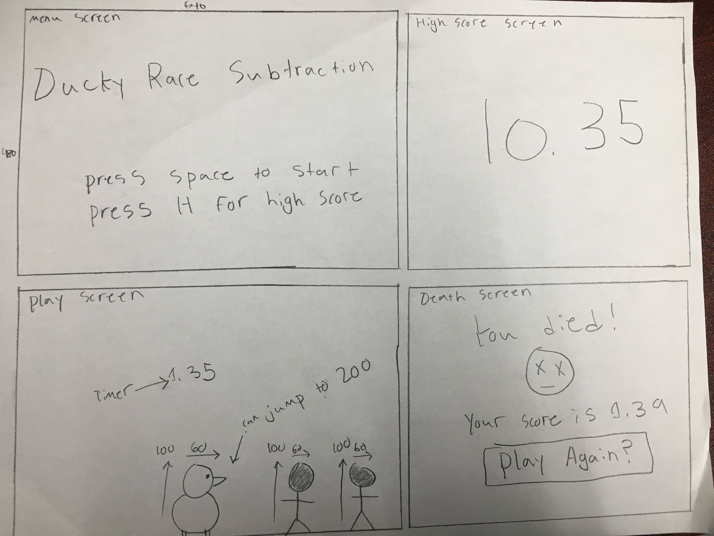

# D Ducky Race

## THE GAME
### Objective of the Game

The objective of D Ducky Race is to press the right key to jump over the obstacles and gain the highest score possible before you die.

### Game Instructions

You are a duck who is being chased by poachers.  The only way to beat them is by jumping over them.  In order to jump over the poachers, you have to press the answer to the subtraction that appears randomly.  While you are in the air, you can continue pressing the correct key to keep the duck in the air (by "flapping its wings").

### Scoring

The game is timed, and a higher score is a higher time (you die slower).

### Functionality and Limitations

Functionality:
You are able to jump, and keep the duck in the air by continuously pressing the correct key. You can continue playing this game with the browser open for as long as you want to.

Limitations:
The collision detection does not pick up on the duck's legs(too difficult otherwise).  You are only able to control the duck's movement upwards.

## SCREEN MOCKUPS

